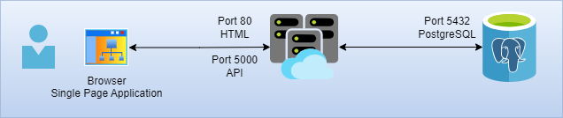

# Workshop demo APP

Esta es una aplicación simple, de 3 capas, que utilizaremos para recorrer el ciclo de vida hasta la puesta en producción.

Abarcaremos:

- Deploy manual de la aplicación, de forma monolítica, en una VM de prueba.
- Proceso de convertir cada capa en un container.
- Proceso de Integración contínua para el building de los contenedores.
- Deploy manual de los contenedores usando un runtime simple (Podman o Docker).
- Creación de manifiestos para deploy de la aplicación en OpenShift.
- Deploy manual de los contenedores con sus manifiestos en un ambiente OpenShift de Test
- Proceso de Deploy contínuo, usando Helms y ArgoCD.
- Deploy automático de la aplicación en un ambiente de Producción.

## Arquitectura de la aplicación

La aplicación cuenta con un Single Page Application (SPA) contenida en un único archivo .html, que encapsula el contenido, los estilos y los scripts Javascript para la ejecución.
La aplicación se descarga, y corre íntegramente en el browser.

Esta SPA se comunica con una API en el backend para enviarle información que la API deberá persistir en una base PostgreSQL.

La SPA tambien puede pedirle a la API los últimos 5 registros grabados, y los mostrará en una ventana Modal.

